## New way to juice our games just dropped!

tweens.gd is a fully free and libre open source tweening system for Godot 4 - playful and flexible as a ferret!\
This addon values concise and consistent syntax, and offers more [interesting easing options](https://tweens.gd/easings/) than most.

### ... easy to get [started](https://tweens.gd/tutorial/)

My, *have we got* a **tutorial** for you! Just 5 steps, but it's pure goodness!

#### ➡️ [tweens.gd/tutorial](https://tweens.gd/tutorial/) ⬅️

### ... enjoy amazing [documentation](https://tweens.gd/easings/)

### ... respects your <u>[time](https://tweens.gd)</u> and your <u>keycaps!</u>

## Deets and dooks

This is a MIT licensed, free addon, and it supports both GDScript and C# out of the box. It's made out of love for indie devs and satisfying game feel. Get support and show us your cool stuff on the [⤜outfox⤏ Discord](https://discord.gg/3UXVHnmEwd).

May your code be short and your ferrets be long!

... dook, dook! ♥️
