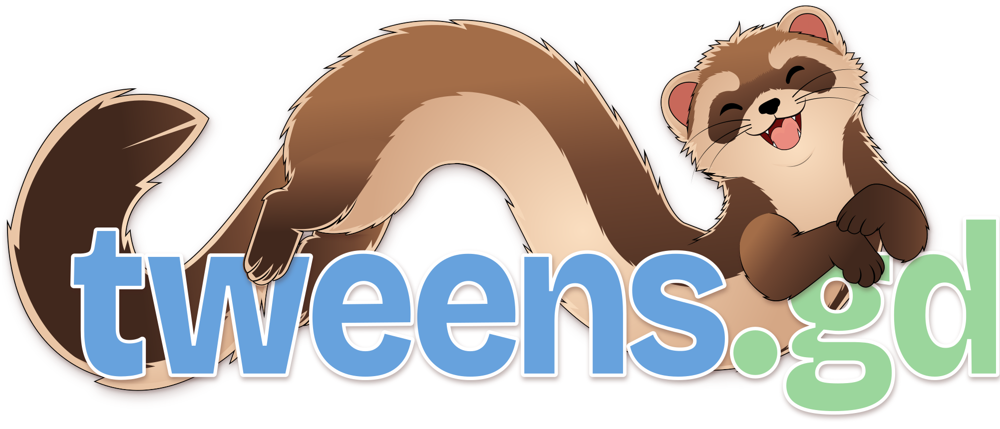

# tweens.gd

tweens.gd is a Godot addon for C# and GDScript. Reuse tween definitions, control
playback, link motions with Chains, and coordinate completion with async/await. Both APIs are in beta.

- [Download from the Godot Asset Store](https://store.godotengine.org/asset/outfox/tweens/)
- [Documentation](https://tweens.gd)
- [Official Discord](https://discord.gg/3UXVHnmEwd)
